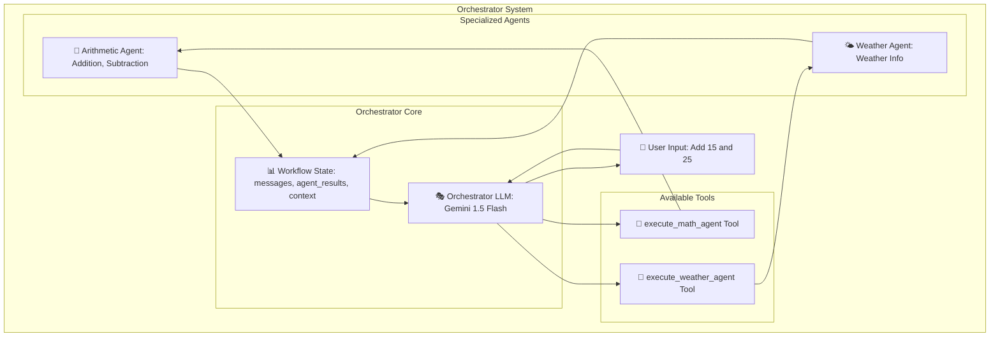
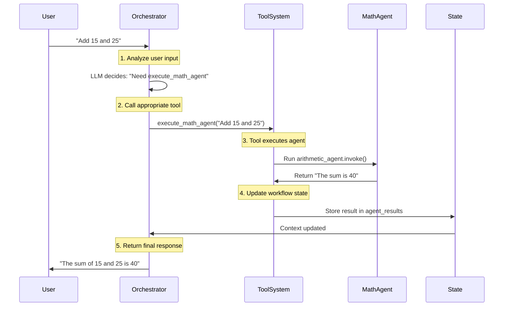
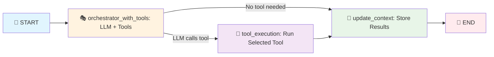

# LangGraph Orchestrator Agent - Complete Guide

## 🎭 What is an Orchestrator?

• **Definition**: Central coordinator that manages multiple specialized agents
• **Purpose**: Routes requests to appropriate agents and coordinates workflows
• **Role**: Acts like a "manager" deciding which "employee" (agent) should handle each task
• **Intelligence**: Uses LLM to make smart routing decisions based on user input

## 🏗️ Orchestrator Architecture



### **ASCII Architecture Overview**

```
┌─────────────── ORCHESTRATOR SYSTEM ───────────────┐
│                                                       │
│  👤 USER INPUT: "Add 15 and 25"                      │
│                     │                                 │
│                     ▼                                 │
│  ┌─────────── ORCHESTRATOR CORE ───────────┐        │
│  │                                          │        │
│  │  🎭 ORCHESTRATOR LLM                     │        │
│  │  ┌─────────────────────────────────┐    │        │
│  │  │ Gemini 1.5 Flash               │    │        │
│  │  │ • Analyzes user input           │    │        │
│  │  │ • Selects appropriate tools     │    │        │
│  │  │ • Manages workflow              │    │        │
│  │  └─────────────────────────────────┘    │        │
│  │                                          │        │
│  │  📊 WORKFLOW STATE                       │        │
│  │  ┌─────────────────────────────────┐    │        │
│  │  │ • messages: conversation        │    │        │
│  │  │ • agent_results: tool outputs   │    │        │
│  │  │ • context: shared information   │    │        │
│  │  └─────────────────────────────────┘    │        │
│  └──────────────┬───────────────────────────┘        │
│                 │                                     │
│                 ▼                                     │
│  ┌──────── AVAILABLE TOOLS ────────┐                 │
│  │                                 │                 │
│  │  🔧 execute_math_agent          │                 │
│  │  ┌─────────────────────────┐    │                 │
│  │  │ • Handles math queries  │────┼──┐              │
│  │  │ • Accepts context       │    │  │              │
│  │  └─────────────────────────┘    │  │              │
│  │                                 │  │              │
│  │  🔧 execute_weather_agent       │  │              │
│  │  ┌─────────────────────────┐    │  │              │
│  │  │ • Handles weather queries│────┼──┼──┐           │
│  │  │ • Accepts context       │    │  │  │           │
│  │  └─────────────────────────┘    │  │  │           │
│  └─────────────────────────────────┘  │  │           │
│                                       │  │           │
│                                       ▼  ▼           │
│  ┌─────── SPECIALIZED AGENTS ───────┐               │
│  │                                  │               │
│  │  🧮 ARITHMETIC AGENT             │               │
│  │  ┌─────────────────────────┐     │               │
│  │  │ • Addition tool         │◀────┘               │
│  │  │ • Subtraction tool      │                     │
│  │  │ • Math operations       │                     │
│  │  └─────────────────────────┘                     │
│  │                                                  │
│  │  🌤️ WEATHER AGENT              │               │
│  │  ┌─────────────────────────┐     │               │
│  │  │ • Weather info tool     │◀────────────────────┘
│  │  │ • Location queries      │
│  │  │ • Climate data          │
│  │  └─────────────────────────┘
│  └──────────────────────────────────────────────────┘
│
└───────────────────────────────────────────────────────┘
```

## 🔄 Orchestrator Flow Examples



### **ASCII Flow Diagrams**

#### **Example 1: Math Question**

```
👤 USER: "Add 15 and 25"
 │
 ▼
┌─────────────────────────────────────────────────────────────┐
│ 🎭 ORCHESTRATOR (Gemini 1.5 Flash)                         │
│                                                             │
│ 1. LLM Analyzes: "This is a math question"                 │
│ 2. LLM Decides: "I need execute_math_agent tool"           │
│                                                             │
└────────────────────┬────────────────────────────────────────┘
                     │
                     ▼
┌─────────────────────────────────────────────────────────────┐
│ 🔧 TOOL EXECUTION: execute_math_agent("Add 15 and 25")     │
│                                                             │
│ 3. Tool receives call with parameters                      │
│ 4. Tool runs: arithmetic_agent.invoke()                    │
│                                                             │
└────────────────────┬────────────────────────────────────────┘
                     │
                     ▼
┌─────────────────────────────────────────────────────────────┐
│ 🧮 ARITHMETIC AGENT                                         │
│                                                             │
│ 5. Processes: "Add 15 and 25"                              │
│ 6. Uses addition_tool: 15.0 + 25.0 = 40.0                 │
│ 7. Returns: "The sum of 15 and 25 is 40"                  │
│                                                             │
└────────────────────┬────────────────────────────────────────┘
                     │
                     ▼
┌─────────────────────────────────────────────────────────────┐
│ 📊 WORKFLOW STATE UPDATE                                    │
│                                                             │
│ 8. Store in agent_results: {"step_0": "The sum is 40"}     │
│ 9. Update context: "Latest result: The sum is 40"         │
│                                                             │
└────────────────────┬────────────────────────────────────────┘
                     │
                     ▼
👤 USER RECEIVES: "The sum of 15 and 25 is 40"
```

#### **Example 2: Weather Question**

```
👤 USER: "What's the weather in Tokyo?"
 │
 ▼
┌─────────────────────────────────────────────────────────────┐
│ 🎭 ORCHESTRATOR (Gemini 1.5 Flash)                         │
│                                                             │
│ 1. LLM Analyzes: "This is a weather question"              │
│ 2. LLM Decides: "I need execute_weather_agent tool"        │
│                                                             │
└────────────────────┬────────────────────────────────────────┘
                     │
                     ▼
┌─────────────────────────────────────────────────────────────┐
│ 🔧 TOOL EXECUTION: execute_weather_agent("Tokyo weather")  │
│                                                             │
│ 3. Tool receives call with parameters                      │
│ 4. Tool runs: weather_agent.invoke()                       │
│                                                             │
└────────────────────┬────────────────────────────────────────┘
                     │
                     ▼
┌─────────────────────────────────────────────────────────────┐
│ 🌤️ WEATHER AGENT                                           │
│                                                             │
│ 5. Processes: "Weather in Tokyo"                           │
│ 6. Uses get_weather_info tool for Tokyo                    │
│ 7. Returns: "Tokyo: Sunny, 22°C, light breeze"            │
│                                                             │
└────────────────────┬────────────────────────────────────────┘
                     │
                     ▼
┌─────────────────────────────────────────────────────────────┐
│ 📊 WORKFLOW STATE UPDATE                                    │
│                                                             │
│ 8. Store in agent_results: {"step_0": "Tokyo weather"}     │
│ 9. Update context: "Latest result: Sunny in Tokyo"        │
│                                                             │
└────────────────────┬────────────────────────────────────────┘
                     │
                     ▼
👤 USER RECEIVES: "Tokyo: Sunny, 22°C, light breeze"
```

#### **Example 3: General Chat (No Tools)**

```
👤 USER: "Hello! How are you today?"
 │
 ▼
┌─────────────────────────────────────────────────────────────┐
│ 🎭 ORCHESTRATOR (Gemini 1.5 Flash)                         │
│                                                             │
│ 1. LLM Analyzes: "This is general conversation"            │
│ 2. LLM Decides: "No tools needed, I can respond directly"  │
│                                                             │
└────────────────────┬────────────────────────────────────────┘
                     │
                     ▼ (NO TOOL EXECUTION)
┌─────────────────────────────────────────────────────────────┐
│ 💬 DIRECT RESPONSE                                          │
│                                                             │
│ 3. LLM generates friendly response                         │
│ 4. No agent execution needed                               │
│ 5. Responds: "Hello! I'm doing well, thank you!"           │
│                                                             │
└────────────────────┬────────────────────────────────────────┘
                     │
                     ▼
┌─────────────────────────────────────────────────────────────┐
│ 📊 WORKFLOW STATE UPDATE                                    │
│                                                             │
│ 6. Store in agent_results: {"step_0": "direct_response"}   │
│ 7. Update context: "Latest result: Greeting exchanged"     │
│                                                             │
└────────────────────┬────────────────────────────────────────┘
                     │
                     ▼
👤 USER RECEIVES: "Hello! I'm doing well, thank you!"
```

## 🔧 What are Nodes and Edges?

### **Nodes (Processing Units)**

• **Definition**: Individual functions that perform specific tasks in the workflow
• **Purpose**: Each node does one specific job (analyze, execute, update)
• **Types in Orchestrator**:

- `orchestrator_with_tools`: Main decision-making node
- `tool_execution`: Executes the chosen tools
- `update_context`: Updates workflow state with results

### **Edges (Flow Control)**

• **Definition**: Connections between nodes that control workflow direction
• **Purpose**: Define what happens after each node completes
• **Types**:

- **Simple Edge**: Always go from Node A to Node B
- **Conditional Edge**: Decision point based on node output

## 🛠️ Workflow Graph Structure



### **ASCII Workflow Graph**

```
🚀 START
   │
   ▼
┌─────────────────────────────────┐
│ 🎭 orchestrator_with_tools      │
│ (LLM + Tools)                   │
│                                 │
│ • Analyzes user input           │
│ • Decides which tool to use     │
│ • Can respond directly          │
└─────────┬───────────────────────┘
          │
          ▼
      ┌───────┐
      │ TOOLS │ ◀── LLM calls tool?
      │ USED? │
      └───┬───┘
          │
     ┌────▼────┐
  YES│         │NO
     ▼         ▼
┌─────────┐ ┌─────────────────────┐
│🔧 tool_ │ │📝 update_context    │
│execution│ │                     │
│         │ │ • Store results     │
│ • Run   │ │ • Update state      │
│ selected│ │ • Pass context      │
│ tool    │ │                     │
└────┬────┘ └─────────────────────┘
     │                   ▲
     │                   │
     └───────────────────┘
                         │
                         ▼
                    🏁 END
```

## 📊 Node Responsibilities

| Node                        | Function                             | Input                  | Output                        |
| --------------------------- | ------------------------------------ | ---------------------- | ----------------------------- |
| **orchestrator_with_tools** | LLM analyzes input and selects tools | User message + context | Tool calls or direct response |
| **tool_execution**          | Executes the tools chosen by LLM     | Tool calls             | Tool results                  |
| **update_context**          | Updates workflow state with results  | Tool results           | Updated state                 |

## 🔗 How Nodes are Linked

### **Edge Definitions in Code**

```python
# Simple edge - always go to next node
graph_builder.add_edge(START, "orchestrator_with_tools")

# Conditional edge - decision based on LLM output
graph_builder.add_conditional_edges(
    "orchestrator_with_tools",
    tools_condition,  # Function that checks if tools were called
    {
        "tools": "tool_execution",      # If tools called → go to tool_execution
        "__end__": "update_context"     # If no tools → go to update_context
    }
)

# Simple edge - always update context after tool execution
graph_builder.add_edge("tool_execution", "update_context")

# Simple edge - always end after context update
graph_builder.add_edge("update_context", END)
```

## 🎯 Why This Structure is Required

### **Separation of Concerns**

• **orchestrator_with_tools**: Decision making only
• **tool_execution**: Tool running only  
• **update_context**: State management only

### **Flexibility**

• **Multiple paths**: Can execute tools or respond directly
• **State tracking**: Each step updates the workflow state
• **Context passing**: Results flow between nodes

### **Scalability**

• **Easy to add nodes**: New processing steps can be inserted
• **Easy to modify flow**: Change edges to alter workflow
• **Debugging**: Each node can be tested independently

## 🔄 Workflow State Management

### **State Structure**

```python
class SimpleWorkflowState(TypedDict):
    messages: list              # Conversation history
    agent_results: Dict[str, str]   # Results from each agent
    context: str                # Context to pass between agents
```

### **State Flow**

• **Initial**: Empty state with user message
• **After tool execution**: Results stored in `agent_results`
• **Context update**: Latest results become `context`
• **Next iteration**: Context passed to subsequent tool calls

### **ASCII State Flow Diagram**

```
INITIAL STATE                    AFTER TOOL EXECUTION              CONTEXT UPDATE
┌─────────────────┐              ┌─────────────────┐              ┌─────────────────┐
│ 📊 Workflow     │              │ 📊 Workflow     │              │ 📊 Workflow     │
│    State        │              │    State        │              │    State        │
│                 │              │                 │              │                 │
│ messages: [     │              │ messages: [     │              │ messages: [     │
│   "Add 15+25"   │ ──tool──►    │   "Add 15+25"   │ ──update──►  │   "Add 15+25"   │
│ ]               │ execution    │   "Sum is 40"   │              │   "Sum is 40"   │
│                 │              │ ]               │              │ ]               │
│ agent_results:  │              │                 │              │                 │
│ {}              │              │ agent_results:  │              │ agent_results:  │
│                 │              │ {               │              │ {               │
│ context: ""     │              │   "step_0":     │              │   "step_0":     │
│                 │              │   "Sum is 40"   │              │   "Sum is 40"   │
└─────────────────┘              │ }               │              │ }               │
                                 │                 │              │                 │
                                 │ context: ""     │              │ context:        │
                                 │                 │              │ "Latest result: │
                                 └─────────────────┘              │  Sum is 40"     │
                                                                  └─────────────────┘
                                                                            │
                                                                            ▼
                                                                   NEXT TOOL CALL
                                                                   ┌─────────────────┐
                                                                   │ Tool receives:  │
                                                                   │                 │
                                                                   │ query: "new Q"  │
                                                                   │ context:        │
                                                                   │ "Latest result: │
                                                                   │  Sum is 40"     │
                                                                   └─────────────────┘

🔄 STATE EVOLUTION FLOW:

  Empty State → Tool Execution → Results Stored → Context Updated → Next Iteration
      ↑                                                                    │
      └────────────────────── Loop for multi-step workflows ──────────────┘
```

## 🛠️ Tool Execution Pattern

### **How Tools Work**

```python
@tool
def execute_math_agent(query: str, context: str = "") -> str:
    # 1. Add context if available
    if context:
        full_query = f"Previous context: {context}\nMath question: {query}"

    # 2. Execute the actual agent
    result = self.arithmetic_agent.invoke({"messages": [{"role": "user", "content": full_query}]})

    # 3. Return result to orchestrator
    return result["messages"][-1].content
```

### **Why Tools are Better than Direct Routing**

• **LLM Control**: LLM decides when and how to use tools
• **Parameter Passing**: Tools accept parameters (query, context)
• **Return Values**: Results flow back to LLM automatically
• **Context Awareness**: Tools can use previous results

## 🎓 Key Benefits of Orchestrator Architecture

### **Intelligence**

• **Smart Decisions**: LLM analyzes and chooses appropriate tools
• **Context Awareness**: Each step can use previous results
• **Flexible Routing**: Dynamic tool selection based on input

### **Maintainability**

• **Clear Structure**: Each node has single responsibility
• **Easy Debugging**: State visible at each step
• **Modular Design**: Add/remove nodes without breaking flow

### **Scalability**

• **New Agents**: Add new tools without changing core logic
• **Complex Workflows**: Multi-step agent coordination
• **State Tracking**: Monitor execution and performance

## 🚀 Production Benefits

• **Error Handling**: Each node can handle errors independently
• **Monitoring**: Track execution at each step
• **Optimization**: Identify bottlenecks in workflow
• **Testing**: Each component testable in isolation
• **Scaling**: Add parallel execution paths easily
